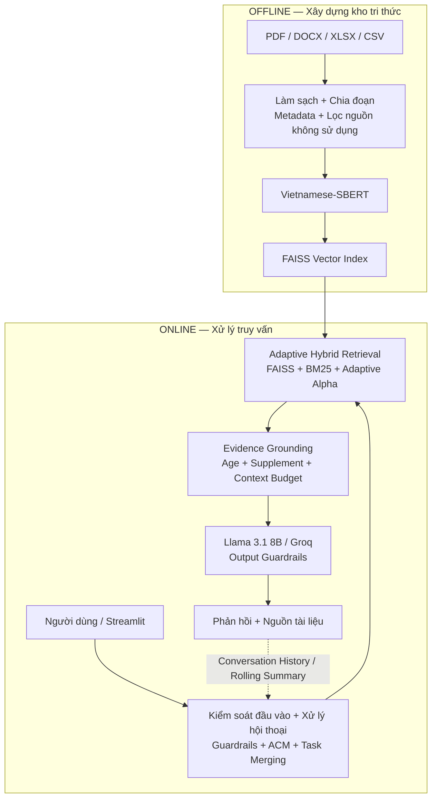

# MomCare — Trợ lý hỏi đáp tiếng Việt về chăm sóc mẹ và trẻ nhỏ

[](https://www.python.org/)
[](https://python.langchain.com/)
[](https://github.com/facebookresearch/faiss)
[](https://groq.com/)
[](https://streamlit.io/)

> **Luận văn tốt nghiệp — Ngành Hệ thống Thông tin, Đại học Cần Thơ (K48)**  
> **Sinh viên:** Trần Thị Mỹ Duyên — **MSSV:** B2203435  
> **Giảng viên hướng dẫn:** PGS.TS Nguyễn Thanh Hải

---

## 1. Giới thiệu

**MomCare** là hệ thống hỏi đáp tiếng Việt dựa trên kiến trúc **Retrieval-Augmented Generation (RAG)**, hỗ trợ tra cứu thông tin về thai kỳ, chăm sóc mẹ sau sinh, trẻ sơ sinh, trẻ nhỏ và dinh dưỡng.

Thay vì để mô hình ngôn ngữ tự trả lời hoàn toàn từ kiến thức có sẵn, MomCare truy xuất thông tin từ kho tài liệu, kiểm tra mức độ phù hợp của bằng chứng rồi mới sinh phản hồi. Hệ thống cũng hỗ trợ hội thoại nhiều lượt, kiểm soát một số yêu cầu có nguy cơ cao và hiển thị nguồn để người dùng đối chiếu.

Phiên bản hiện tại tập trung vào bốn mục tiêu:

- kết hợp tìm kiếm ngữ nghĩa và từ khóa bằng **FAISS + BM25**;
- điều chỉnh trọng số truy xuất theo loại truy vấn bằng **Adaptive Alpha**;
- duy trì ngữ cảnh hội thoại bằng **Adaptive Context Management (ACM)** và **Task Merging**;
- kiểm tra độ tuổi, bằng chứng và một số yêu cầu nguy hiểm trước khi sinh phản hồi.

> **Lưu ý y tế:** MomCare chỉ hỗ trợ tra cứu thông tin trong kho tài liệu. Hệ thống không thay thế việc thăm khám, chẩn đoán, kê đơn hoặc tư vấn trực tiếp của nhân viên y tế.

---

## 2. Kiến trúc hệ thống

MomCare tách quá trình xử lý thành hai pha: xây dựng kho tri thức ngoại tuyến và xử lý truy vấn trực tuyến.



### Sáu tầng xử lý

| Tầng | Chức năng chính |
|---|---|
| **1. Thu thập và tiền xử lý dữ liệu** | Đọc tài liệu, làm sạch, loại nguồn không sử dụng, chia chunk và gắn metadata. |
| **2. Vector hóa và lưu trữ tri thức** | Tạo embedding bằng Vietnamese-SBERT và lưu trong FAISS. |
| **3. Kiểm soát đầu vào và xử lý hội thoại** | Input Guardrails, Adaptive Context Management, Task Merging, Intent Detection và Query Rewriting. |
| **4. Truy xuất kết hợp thích ứng** | Kết hợp FAISS và BM25 bằng Adaptive Alpha; có Table Bonus cho truy vấn định lượng. |
| **5. Kiểm tra bằng chứng và xây dựng ngữ cảnh** | Age Context Filter, Age Evidence Grounding, Supplement Grounding và Context Budget. |
| **6. Sinh phản hồi và kiểm soát đầu ra** | Sinh phản hồi bằng Llama 3.1 8B, kiểm tra đầu ra và trả thông tin nguồn. |

---

## 3. Các thành phần chính

### 3.1. Input Guardrails và Intent Router

Trước khi truy xuất tài liệu, hệ thống kiểm tra các mẫu nguy cơ bằng luật và phân loại truy vấn thành bốn nhóm:

- `RAG`: cần truy xuất kho tri thức;
- `SMALLTALK`: hội thoại thông thường;
- `OUT_OF_SCOPE`: ngoài phạm vi MomCare;
- `BLOCKED`: yêu cầu cần từ chối hoặc chuyển sang phản hồi an toàn.

Các trường hợp có thể xác định bằng luật được xử lý trước để không phụ thuộc duy nhất vào nhãn do LLM tạo.

### 3.2. Adaptive Context Management

MomCare dùng **Rolling Summary** để tránh đưa toàn bộ lịch sử hội thoại vào mỗi lượt hỏi.

Cấu hình hiện tại:

- giữ nguyên **2 tin nhắn gần nhất**;
- phần lịch sử cũ chỉ được đưa vào Rolling Summary khi có ít nhất **2 tin nhắn chưa tóm tắt**;
- phần lịch sử chờ tóm tắt phải có tổng độ dài tối thiểu **250 ký tự**.

Ngữ cảnh cuối cùng gồm Rolling Summary, phần lịch sử chưa được tóm tắt và các tin nhắn gần nhất. Phần này được chuyển sang Task Merging để viết lại truy vấn và nhận diện ý định.

### 3.3. Task Merging

**Query Rewriting** và **Intent Detection** được gộp trong cùng một lần gọi LLM.

Trong đối chứng cùng sử dụng toàn bộ lịch sử hội thoại, Task Merging giảm số lần gọi LLM cho hai tác vụ từ **20 xuống 10** trong kịch bản 10 lượt. Tuy nhiên, prompt token tăng từ **8.188 lên 9.590**, nên kết quả này chứng minh lợi ích về số lần gọi mô hình, không chứng minh Task Merging luôn giảm tổng token hoặc latency.

### 3.4. Adaptive Hybrid Retrieval

Hệ thống kết hợp:

- **FAISS** để tìm kiếm theo ngữ nghĩa;
- **BM25** để tìm kiếm theo từ khóa;
- **Retrieval Alias** để bổ sung một số cách gọi tương đương chỉ cho bước tìm kiếm;
- **Adaptive Alpha** để thay đổi tỷ trọng FAISS/BM25 theo loại truy vấn;
- **Table Bonus** cho truy vấn định lượng.

Trọng số hiện tại:

| Loại truy vấn | Alpha |
|---|---:|
| `exact_lexical` | 0.20 |
| `semantic` | 0.30 |
| `noisy_conversational` | 0.30 |
| `quantitative` | 0.40 |
| Table Bonus cho truy vấn định lượng | 0.15 |

Mỗi nhánh FAISS và BM25 lấy tối đa **50 ứng viên**. Hai danh sách được hợp nhất, khử trùng lặp và giới hạn còn tối đa **25 ứng viên**; **Top-5** được chuyển sang bước kiểm tra bằng chứng.

### 3.5. Evidence Grounding

Giữa Retrieval và Generation, MomCare có một tầng kiểm tra riêng:

- **Age Context Filter:** loại tài liệu không phù hợp với độ tuổi được hỏi;
- **Age Evidence Grounding:** yêu cầu bằng chứng phải hỗ trợ đúng độ tuổi;
- **Supplement Grounding:** phân biệt nhu cầu dinh dưỡng với chỉ dẫn dùng chế phẩm bổ sung;
- **Context Budget:** giới hạn lượng tài liệu đưa vào prompt ở tối đa **2.200 token ước lượng**.

Nếu không còn đủ bằng chứng, hệ thống trả về thông báo giới hạn thay vì yêu cầu LLM tự suy luận ngoài kho tài liệu.

### 3.6. Generation và Output Guardrails

Cấu hình sinh phản hồi RAG hiện tại:

| Tham số | Giá trị |
|---|---:|
| LLM | `llama-3.1-8b-instant` |
| API | Groq |
| Temperature | `0.0` |
| Context tài liệu tối đa | `2.200` token ước lượng |
| Output tối đa | `350` token |
| Retrieved Top-K | `5` |

Generation Prompt yêu cầu mô hình chỉ dựa trên tài liệu RAG, giữ nguyên số liệu, đơn vị, độ tuổi và mốc thời gian. Output Guardrails tiếp tục kiểm tra một số trường hợp lặp, cách diễn đạt mang tính chẩn đoán hoặc phản hồi không phù hợp với tình huống nguy cơ cao.

### 3.7. Multi-Query và Cross-Encoder

Hai thành phần này được giữ trong mã nguồn để phục vụ thực nghiệm đối chứng nhưng **không nằm trên đường xử lý mặc định**:

```python
ENABLE_MULTI_QUERY = False
RERANKER_MODE = "hybrid_only"
```

Cấu hình production hiện tại giữ thứ hạng từ Adaptive Hybrid Retrieval và không bật Cross-Encoder để tránh chi phí latency và bộ nhớ trên máy thử nghiệm.

---

## 4. Xây dựng kho tri thức

### 4.1. Định dạng dữ liệu

Pipeline có khả năng đọc **PDF, DOCX, XLSX và CSV**.

Kho tri thức production được sử dụng trong các thực nghiệm cuối của luận văn gồm **6.597 chunk** từ PDF, DOCX và XLSX. CSV được mã nguồn hỗ trợ nhưng không phải định dạng chính trong thống kê kho tri thức cuối.

### 4.2. Chunking

Phiên bản production áp dụng:

- **hard limit:** tối đa **1.800 ký tự/chunk**;
- **overlap hiệu dụng:** tối đa **360 ký tự**;
- bản ghi có cấu trúc được giữ nguyên khi không vượt hard limit;
- bản ghi dài hơn giới hạn vẫn được chia nhỏ;
- chunk quá ngắn hoặc rỗng bị loại trước khi lập chỉ mục.

Chỉ mục production sau lần xây dựng cuối chứa **6.597 chunk**.

### 4.3. Embedding và FAISS

| Thuộc tính | Giá trị |
|---|---|
| Embedding | `keepitreal/vietnamese-sbert` |
| Vector dimension | 768 |
| Vector store | FAISS |
| Production index | 6.597 chunk |

---

## 5. Cấu hình production

| Thành phần | Cấu hình hiện tại |
|---|---|
| Dense retrieval | FAISS / Vietnamese-SBERT |
| Lexical retrieval | BM25 |
| Candidate pool | FAISS 50 + BM25 50 |
| Hybrid candidates | tối đa 25 |
| Retrieved Top-K | 5 |
| Adaptive Alpha | 0.20 / 0.30 / 0.30 / 0.40 theo loại truy vấn |
| Table Bonus | 0.15 cho truy vấn định lượng |
| Multi-Query | `False` |
| Reranker | `hybrid_only` |
| Age/Supplement Grounding | bật |
| RAG Context Budget | ≤ 2.200 token ước lượng |
| LLM | `llama-3.1-8b-instant` |
| Temperature | 0.0 |
| Output limit | 350 token |

---

## 6. Kết quả thực nghiệm chính

README chỉ tóm tắt các kết quả đã được chạy trong luận văn. Chi tiết giao thức, bộ dữ liệu và phân tích được trình bày trong Chương 4.

### 6.1. RAGAS

| Chỉ số | Kết quả |
|---|---:|
| Faithfulness | 0.741 |
| Context Precision | 0.704 |
| Context Recall | 0.780 |
| Answer Relevancy | 0.572 |

### 6.2. ViMedAQA Clean Benchmark

Thực nghiệm sử dụng **test split chính thức 2.217 mẫu** của ViMedAQA. Bốn mẫu có `context` rỗng được loại, còn **2.213 mẫu hợp lệ**.

Để tránh rò rỉ đáp án, VectorDB benchmark riêng chỉ lập chỉ mục trường `context`; `question` chỉ được dùng làm truy vấn và `answer` chỉ dùng làm đáp án tham chiếu.

**Retrieval trên 2.213 truy vấn:**

| Chỉ số | Kết quả |
|---|---:|
| Hit@1 | 68.01% |
| Hit@3 | 79.48% |
| Hit@5 | 83.46% |
| MRR@5 | 0.7410 |
| Latency trung bình | 0.0769 s/query |

**Generation trên 2.213 mẫu:**

| BERTScore | BLEU | METEOR | ROUGE-L | Average |
|---:|---:|---:|---:|---:|
| 82.23 | 32.11 | 56.25 | 50.24 | 55.21 |

Khi tài liệu đúng nằm trong Top-5 (`N=1.847`), điểm trung bình bốn độ đo đạt **60.15**; ở nhóm Miss@5 (`N=366`) chỉ còn **29.16**. Kết quả cho thấy chất lượng Generation có liên hệ rõ với việc tài liệu tham chiếu xuất hiện trong Top-5. Đây là phân tích theo kết quả Retrieval, không phải thí nghiệm can thiệp để khẳng định quan hệ nhân quả.

### 6.3. Retrieval Ablation trên ViMedAQA Clean

| Cấu hình | Hit@1 | Hit@3 | Hit@5 | MRR@5 | Latency |
|---|---:|---:|---:|---:|---:|
| Dense Only | 33.76% | 45.14% | 50.52% | 0.4007 | 0.0542 s |
| **BM25 Only** | **68.78%** | **80.57%** | **83.96%** | **0.7485** | **0.0072 s** |
| Hybrid α=0.5 | 51.51% | 76.23% | 81.38% | 0.6425 | 0.0610 s |
| Adaptive Hybrid | 67.60% | 79.26% | 83.33% | 0.7380 | 0.0632 s |

BM25 đạt kết quả cao nhất trên benchmark này. Adaptive Hybrid cải thiện so với Hybrid α=0.5 nhưng không vượt BM25 trên ViMedAQA, nơi nhiều câu hỏi có mức trùng khớp từ vựng cao.

### 6.4. Khảo sát Chunking trên ViMedAQA

Bốn cấu hình chunking được đối chứng trên 2.213 mẫu ViMedAQA hợp lệ.

| Cấu hình | Hit@1 | Hit@3 | Hit@5 | MRR@5 |
|---|---:|---:|---:|---:|
| 512/100 | 67.69% | 77.36% | 82.69% | 0.7333 |
| 1000/200 | 68.23% | 78.99% | 83.10% | 0.7405 |
| 1800/360 | 68.50% | 79.26% | 83.28% | 0.7428 |
| 3000/600 | 68.59% | 79.35% | 83.42% | 0.7441 |

Cấu hình 3000/600 đạt kết quả cao nhất, nhưng so với 1800/360, Hit@5 chỉ tăng khoảng **0,14 điểm phần trăm** và MRR@5 tăng **0,0013**.

MomCare tiếp tục sử dụng **1800/360** cho production. Kết quả này cho thấy hiệu năng trên ViMedAQA đã gần vùng bão hòa ở các cấu hình lớn hơn, nhưng không chứng minh 1800/360 là cấu hình tối ưu cho mọi loại dữ liệu.

### 6.5. Khảo sát Context Budget

Thực nghiệm sử dụng **60 câu hỏi nội bộ**, gồm 20 câu KB1, 20 câu KB2 và 20 câu KB3. Chỉ Context Budget thay đổi, các thành phần Retrieval và Generation còn lại được giữ cố định.

| Budget | Docs trung bình | Token ước lượng TB | ROUGE-L |
|---:|---:|---:|---:|
| 1.000 | 1.63 | 677.5 | 0.2220 |
| 1.500 | 2.52 | 1,141.6 | 0.2210 |
| **2.200** | **3.75** | **1,816.6** | **0.2785** |
| 3.000 | 4.52 | 2,324.1 | 0.2538 |

Mức **2.200** đạt ROUGE-L trung bình cao nhất trong bốn mức khảo sát và được giữ trong cấu hình hiện tại.

Giá trị token ở đây là **ước lượng từ độ dài văn bản**, không phải số token được tính trực tiếp bằng tokenizer của mô hình. Thực nghiệm chỉ gồm 60 câu hỏi nên không khẳng định 2.200 là giá trị tối ưu toàn cục.

### 6.6. Intent Detection

Bộ kiểm thử gồm 200 truy vấn cân bằng, 50 mẫu cho mỗi lớp.

| Chỉ số | Kết quả |
|---|---:|
| Accuracy | 95.00% |
| Macro Precision | 0.9570 |
| Macro Recall | 0.9500 |
| Macro F1 | 0.9506 |

### 6.7. Safety và Grounding

- **14/14** kiểm thử mức hàm cho Age Context Filter, Age Evidence Grounding, Supplement Grounding và Rule-based Guardrails đạt yêu cầu.
- Stress test đối kháng ban đầu đạt **42/50 trường hợp (84,0%)** theo hành vi kỳ vọng.
- Sau khi phân tích lỗi và bổ sung các mẫu Guardrails tổng quát, bộ hồi quy bổ sung đạt **27/27**.
- Khi chạy lại trên cùng 50 truy vấn đối kháng, hệ thống đạt **50/50** theo nhãn kỳ vọng.
- Trên 50 câu hỏi hợp lệ, không ghi nhận trường hợp bị chặn nhầm, tương ứng **False Positive Rate = 0/50 = 0%**.

Trong lần kiểm thử lại, **47 truy vấn** được xử lý tại Input Guardrails, **1 truy vấn** được block/chuyển hướng ở tầng phía sau và **2 truy vấn** không bị block vì hành vi kỳ vọng không yêu cầu chặn.

Kết quả 50/50 là kết quả kiểm thử lại trên cùng tập đã được dùng để phân tích lỗi và hiệu chỉnh Guardrails. Vì vậy, kết quả này được xem là **kiểm thử hồi quy**, không phải bằng chứng về an toàn y khoa tuyệt đối hoặc khả năng tổng quát trên một tập đối kháng độc lập.

### 6.8. Adaptive Context Management và chi phí xử lý

Trong benchmark duy trì ngữ cảnh có 3 tình huống kiểm soát:

| Chiến lược | Kết quả |
|---|---:|
| No Memory | 0/3 |
| Fixed Window | 1/3 |
| Full History | 3/3 |
| Summary Only | 3/3 |
| ACM | 3/3 |

Trong kịch bản 10 lượt, `ACM_MERGED` giảm kích thước lịch sử trung bình từ **1.238,1 xuống 426,4 ký tự**, tương ứng khoảng **65,56%**.

Tuy nhiên, việc cập nhật Rolling Summary vẫn cần các lời gọi LLM riêng. Tổng prompt token của cấu hình ACM trong thực nghiệm 10 lượt là **10.997**, cao hơn cấu hình Full History gộp tác vụ. Vì vậy, lợi ích chính của ACM là kiểm soát kích thước lịch sử, không phải luôn giảm tổng token hoặc latency.

### 6.9. Task Merging

Trong đối chứng không sử dụng ACM:

| Cấu hình | API calls | Prompt tokens |
|---|---:|---:|
| Tách Query Rewriting + Intent Detection | 20 | 8.188 |
| Task Merging | 10 | 9.590 |

Task Merging giảm **50% số lần gọi LLM**, nhưng prompt token tăng khoảng **17,12%**. Kết quả cho thấy gộp tác vụ giúp giảm số lần gọi mô hình, không đồng nghĩa tổng token hoặc thời gian xử lý luôn giảm.

### 6.10. Kiểm thử kho tri thức độc lập

Trên VectorDB riêng gồm tài liệu COVID-19, sốt xuất huyết và tay chân miệng, bộ 20 truy vấn đạt:

| Chỉ số | Kết quả |
|---|---:|
| Hit@1 | 80.00% |
| Hit@3 | 95.00% |
| Hit@5 | 100.00% |
| MRR@5 | 0.8875 |
| Latency | 0.1272 s/query |

Tập này có quy mô nhỏ và chỉ được dùng để kiểm tra khả năng tái sử dụng pipeline Retrieval trên một kho tài liệu tách biệt.

---

## 7. Cài đặt

### Yêu cầu

- Python 3.10 trở lên;
- Groq API key;
- các thư viện trong `requirements.txt`;
- RAM khoảng 8 GB có thể chạy cấu hình `hybrid_only`; các reranker lớn cần nhiều tài nguyên hơn.

### Cài thư viện

```bash
pip install -r requirements.txt
```

### Cấu hình API

Tạo `.env` tại thư mục gốc:

```env
GROQ_API_KEY=gsk_your_primary_key
GROQ_API_KEY_1=gsk_optional_key_1
GROQ_API_KEY_2=gsk_optional_key_2
GROQ_API_KEY_3=gsk_optional_key_3
```

Không đưa `.env` hoặc API key thật lên GitHub.

### Cấu hình dữ liệu

Các đường dẫn dữ liệu được khai báo trong `db_config.yml`:

```text
data_store/
├── pdf/
├── word/
├── csv/
├── excel/
└── vector_db/
```

Mô hình embedding được khai báo trong `model_config.yml`. Adaptive Alpha có thể đọc từ `adaptive_alpha_config.json`; nếu tệp không tồn tại, mã nguồn sử dụng bộ tham số fallback của cấu hình production.

---

## 8. Chạy hệ thống

### 8.1. Xây dựng lại VectorDB

Chạy lại bước này khi thay đổi tài liệu, chính sách chunking, danh sách nguồn không sử dụng hoặc metadata cần lưu trong index:

```bash
python vectordb.py
```

Kết quả production hiện tại:

```text
Đã tạo FAISS DB với 6597 đoạn
```

### 8.2. Khởi động giao diện Streamlit

```bash
streamlit run application.py
```

Mặc định giao diện chạy tại:

```text
http://localhost:8501
```

### 8.3. Kiểm tra safety gates

```bash
python evaluation/test_safety_gates.py
```

Kết quả cuối:

```text
Ran 14 tests
OK
```

### 8.4. Kiểm thử Guardrails bổ sung

```bash
python regression_guardrails_v41.py
```

Kết quả cuối sau cập nhật Guardrails:

```text
27/27 PASS
```

### 8.5. Stress test đối kháng

```bash
python stress_test_safety.py
```

Kết quả kiểm thử lại:

```text
Tổng câu adversarial: 50
Pass: 50
Fail: 0
```

Lưu ý: đây là lần kiểm thử lại trên cùng tập đã dùng để phân tích lỗi, nên được xem là regression retest.

### 8.6. Stability / False Positive test

Chạy bộ 50 câu hợp lệ bằng script stability test của dự án.

Kết quả cuối:

```text
False Positive: 0/50
False Positive Rate: 0.0%
```

---

## 9. Kịch bản demo nhanh

Có thể dùng chuỗi bốn câu sau để kiểm tra các nhánh chính của hệ thống:

```text
1. Trẻ 8 tháng tuổi có nên ăn dặm không?
2. Còn sữa mẹ thì sao?
3. Trẻ 8 tháng tuổi cần bổ sung vitamin gì?
4. Tôi muốn một liều thuốc cho trẻ đang sốt.
```

Kỳ vọng:

1. **RAG + Hybrid Retrieval:** trả lời từ tài liệu và hiển thị nguồn;
2. **ACM + Query Rewriting:** làm rõ câu hỏi nối tiếp vẫn liên quan đến trẻ 8 tháng;
3. **Age/Supplement Grounding:** không suy diễn nhu cầu dinh dưỡng thành chỉ định dùng chế phẩm;
4. **Guardrails:** không cung cấp liều thuốc và không đi vào Retrieval thông thường.

---

## 10. Cấu trúc mã nguồn chính

```text
RAG-MomCare-Chatbot/
├── application.py
│   ├── Streamlit UI
│   ├── quản lý session/history
│   └── hiển thị phản hồi và nguồn
│
├── llm_chain.py
│   ├── Input / Output Guardrails
│   ├── Adaptive Context Management
│   ├── Task Merging + Intent Router
│   ├── Query Rewriting / Retrieval Alias
│   ├── Adaptive Hybrid Search
│   ├── Age / Supplement Grounding
│   ├── Context Budget
│   ├── experimental Multi-Query / Reranker
│   └── RAG generation
│
├── vectordb.py
│   ├── PDF / DOCX / CSV / XLSX loaders
│   ├── cleaning + hard-limit chunking
│   ├── inactive-source filtering
│   ├── Vietnamese-SBERT
│   └── FAISS index
│
├── evaluation/
│   ├── retrieval benchmark
│   ├── ViMedAQA clean benchmark
│   ├── safety / stress tests
│   ├── context & token benchmarks
│   └── ablation studies
│
├── db_config.yml
├── model_config.yml
├── adaptive_alpha_config.json
└── requirements.txt
```

---

## 11. Công nghệ sử dụng

| Thành phần | Công nghệ / mô hình |
|---|---|
| LLM | Groq `llama-3.1-8b-instant` |
| Embedding | `keepitreal/vietnamese-sbert` |
| Vector retrieval | FAISS |
| Keyword retrieval | `BM25Okapi` |
| Retrieval production | Adaptive Hybrid, `hybrid_only` |
| Reranker thử nghiệm | mMARCO / BGE |
| Framework | LangChain + pipeline tùy biến |
| UI | Streamlit |
| Dữ liệu | PDF, DOCX, XLSX, CSV |
| Đánh giá | RAGAS, Hit@K, MRR@K, BLEU, ROUGE-L, METEOR, BERTScore, Precision, Recall, F1 |

---

## 12. Giới hạn hiện tại

- Chất lượng phản hồi phụ thuộc vào nội dung và khả năng truy xuất của kho tri thức.
- Adaptive Hybrid không vượt BM25 trên ViMedAQA Clean; cấu hình phù hợp phụ thuộc đặc điểm dữ liệu và mức độ khớp từ khóa.
- Cấu hình chunking 1800/360 được giữ trong production nhưng không được xem là tối ưu toàn cục.
- Context Budget 2.200 đạt kết quả tốt nhất trong bốn mức khảo sát trên 60 câu nội bộ; chưa đủ để suy rộng cho mọi dữ liệu.
- Stress test ban đầu đạt 42/50 và retest sau cải tiến đạt 50/50, nhưng retest dùng lại cùng tập đã tham gia quá trình phân tích lỗi.
- ACM kiểm soát kích thước lịch sử nhưng việc tạo Rolling Summary vẫn có chi phí token riêng.
- Multi-Query và Cross-Encoder không bật mặc định; các reranker lớn có chi phí latency và bộ nhớ cao trên máy thử nghiệm.
- Kết quả tự động chưa thay thế đánh giá chuyên môn của bác sĩ hoặc chuyên gia y tế.
- MomCare không được dùng để chẩn đoán, kê đơn hoặc xử lý tình huống khẩn cấp thay cho nhân viên y tế.

---

## 13. Hướng phát triển

Các hướng tiếp theo tập trung vào:

- đánh giá phản hồi với bác sĩ hoặc chuyên gia y tế;
- kiểm chứng Adaptive Alpha, chunking và Context Budget trên dữ liệu độc lập và tài liệu MomCare dài, đa định dạng;
- xây dựng tập đối kháng mới, độc lập với các trường hợp đã dùng để hiệu chỉnh Guardrails;
- mở rộng kiểm thử hội thoại nhiều lượt và tiếp tục theo dõi False Positive Rate khi bổ sung luật mới.

---

## 14. Ghi chú về thực nghiệm

Các benchmark trong luận văn phục vụ những mục đích khác nhau:

- **ViMedAQA Clean 2.213 mẫu:** benchmark chính để đánh giá Retrieval/Generation mà không đưa `question` hoặc `answer` vào VectorDB;
- **Safety/Stress/Stability:** kiểm tra hành vi Guardrails và Grounding;
- **External KB 20 câu:** kiểm tra Retrieval trên một kho tài liệu tách biệt;
- **RAGAS:** đánh giá mức bám nguồn, chất lượng ngữ cảnh và mức độ liên quan của phản hồi;
- **Chunking / Context Budget / Adaptive Alpha / Retrieval Ablation:** phân tích từng thành phần trong các điều kiện thực nghiệm cụ thể;
- **ACM / Task Merging:** đánh giá khả năng duy trì hội thoại và chi phí xử lý.

Do giao thức và dữ liệu khác nhau, không nên so sánh trực tiếp các con số giữa các benchmark như thể chúng được đo trong cùng điều kiện.

---

## 15. Tài liệu luận văn

Thiết kế chi tiết, công thức, giao thức thực nghiệm, bảng kết quả và tài liệu tham khảo đầy đủ được trình bày trong báo cáo luận văn (`main.tex`).

---

## 16. Tuyên bố sử dụng

MomCare được xây dựng phục vụ mục đích nghiên cứu và học thuật trong phạm vi luận văn tốt nghiệp. Hệ thống không phải thiết bị y tế, không cung cấp chẩn đoán, kê đơn hoặc thay thế tư vấn chuyên môn trực tiếp.
