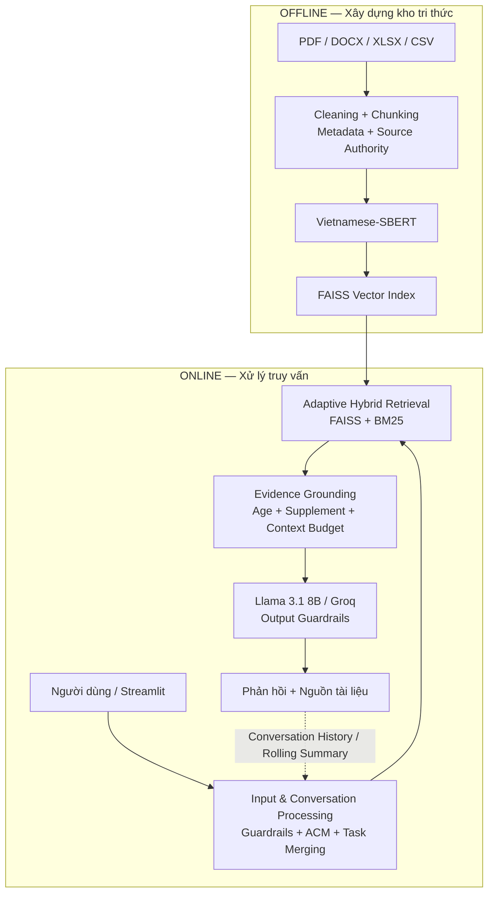

# MomCare — Trợ lý hỏi đáp tiếng Việt về chăm sóc mẹ và trẻ nhỏ

[](https://www.python.org/)
[](https://python.langchain.com/)
[](https://github.com/facebookresearch/faiss)
[](https://groq.com/)
[](https://streamlit.io/)

> **Luận văn tốt nghiệp — Ngành Hệ thống Thông tin, Đại học Cần Thơ (K48)**  
> **Sinh viên:** Trần Thị Mỹ Duyên — **MSSV:** B2203435  
> **Giảng viên hướng dẫn:** PGS.TS Nguyễn Thanh Hải

---

## 1. Giới thiệu

**MomCare** là hệ thống hỏi đáp tiếng Việt dựa trên kiến trúc **Retrieval-Augmented Generation (RAG)**, hỗ trợ tra cứu thông tin về thai kỳ, chăm sóc mẹ sau sinh, trẻ sơ sinh, trẻ nhỏ và dinh dưỡng.

Thay vì để mô hình tự trả lời từ kiến thức sẵn có, MomCare truy xuất tài liệu trong kho tri thức, kiểm tra mức độ phù hợp của bằng chứng rồi mới tạo phản hồi. Hệ thống đồng thời duy trì ngữ cảnh hội thoại nhiều lượt và hiển thị nguồn để người dùng có thể đối chiếu.

Phiên bản hiện tại tập trung vào bốn mục tiêu:

- kết hợp truy xuất ngữ nghĩa và từ khóa bằng FAISS + BM25;
- ưu tiên nguồn và kiểm tra bằng chứng trước khi gọi LLM;
- hạn chế suy diễn sai độ tuổi, nhu cầu dinh dưỡng hoặc hướng dẫn bổ sung vi chất;
- kiểm soát các truy vấn nguy hiểm, prompt injection và yêu cầu vượt phạm vi hỗ trợ.

> **Lưu ý y tế:** MomCare chỉ hỗ trợ tra cứu thông tin trong kho tài liệu. Hệ thống không thay thế việc thăm khám, chẩn đoán, kê đơn hoặc tư vấn trực tiếp của nhân viên y tế.

---

## 2. Kiến trúc hệ thống

MomCare tách quá trình xử lý thành hai pha: xây dựng kho tri thức ngoại tuyến và xử lý truy vấn trực tuyến.



### Sáu tầng xử lý

| Tầng | Chức năng chính |
|---|---|
| **1. Data Ingestion & Preprocessing** | Đọc tài liệu, làm sạch, loại nguồn không sử dụng, chia chunk và gắn metadata. |
| **2. Embedding & Vector Storage** | Tạo embedding bằng Vietnamese-SBERT và lưu trong FAISS. |
| **3. Input & Conversation Processing** | Input Guardrails, Adaptive Context Management, Task Merging, Intent Detection và Query Rewriting. |
| **4. Adaptive Hybrid Retrieval** | Kết hợp FAISS và BM25 bằng Adaptive Alpha, Table Bonus và Source Authority. |
| **5. Evidence Grounding** | Age Context Filter, Age Evidence Grounding, Supplement Grounding và Context Budget. |
| **6. Generation & Output Control** | Sinh phản hồi bằng Llama 3.1 8B, kiểm soát đầu ra và trả nguồn tài liệu. |

---

## 3. Các thành phần chính

### 3.1. Input Guardrails và Intent Router

Trước khi truy xuất tài liệu, hệ thống kiểm tra các mẫu nguy cơ bằng luật và phân loại truy vấn thành bốn nhóm:

- `RAG`: cần truy xuất kho tri thức;
- `SMALLTALK`: hội thoại thông thường;
- `OUT_OF_SCOPE`: ngoài phạm vi MomCare;
- `BLOCKED`: yêu cầu cần từ chối hoặc chuyển sang phản hồi an toàn.

Những trường hợp có thể xác định bằng luật được xử lý trước để không phụ thuộc duy nhất vào nhãn do LLM tạo.

### 3.2. Adaptive Context Management

MomCare dùng **Rolling Summary** để tránh đưa toàn bộ lịch sử hội thoại vào mỗi lượt hỏi. Hệ thống giữ nguyên hai tin nhắn gần nhất và chỉ cập nhật phần lịch sử cũ khi có ít nhất hai tin chờ xử lý với tổng độ dài từ 250 ký tự.

Phần lịch sử sau xử lý được dùng cho Query Rewriting ở lượt tiếp theo.

### 3.3. Task Merging

**Query Rewriting** và **Intent Detection** được gộp trong cùng một lần gọi LLM. Cách triển khai này giảm số API call so với việc thực hiện hai tác vụ độc lập.

### 3.4. Adaptive Hybrid Retrieval

Hệ thống kết hợp:

- **FAISS** để tìm kiếm theo ngữ nghĩa;
- **BM25** để tìm kiếm theo từ khóa;
- **Retrieval Alias** để bổ sung một số cách gọi tương đương chỉ cho bước tìm kiếm;
- **Adaptive Alpha** để thay đổi tỷ trọng Dense/BM25 theo loại truy vấn;
- **Table Bonus** cho truy vấn định lượng;
- **Source Authority** để cộng một mức ưu tiên nhỏ cho nguồn đã được xác minh trong cấu hình.

Trọng số mặc định hiện tại:

| Loại truy vấn | Alpha |
|---|---:|
| `exact_lexical` | 0.20 |
| `semantic` | 0.30 |
| `noisy_conversational` | 0.30 |
| `quantitative` | 0.40 |
| Table Bonus cho truy vấn định lượng | 0.15 |

Mỗi nhánh FAISS và BM25 lấy tối thiểu 50 ứng viên thô. Sau khi hợp nhất, khử trùng lặp và tính điểm, hệ thống giữ tối đa 25 ứng viên chính; Top-5 được chuyển sang bước kiểm tra bằng chứng.

### 3.5. Source Authority

Source Authority là mức ưu tiên do đề tài cấu hình theo **tên nguồn cụ thể**, không phải bộ chấm điểm độ tin cậy tự động cho mọi tài liệu.

| Tier | Authority score | Bonus truy xuất | Số chunk |
|---|---:|---:|---:|
| A | 1.0 | 0.030 | 1.118 |
| B | 0.5 | 0.015 | 62 |
| C | 0.0 | 0.000 | 5.417 |
| **Tổng** | — | — | **6.597** |

Tier C chỉ có nghĩa nguồn chưa được đưa vào danh sách ưu tiên A/B của cấu hình; không đồng nghĩa tài liệu đã được kết luận là sai hoặc kém chất lượng.

Ngoài ra, `INACTIVE_SOURCES` được dùng để loại các nguồn đã có tài liệu thay thế hoặc không còn phù hợp trước khi tạo embedding.

### 3.6. Evidence Grounding

Giữa Retrieval và Generation, MomCare có một tầng kiểm tra riêng:

- **Age Context Filter:** loại tài liệu chỉ đề cập nhóm tuổi không phù hợp với câu hỏi;
- **Age Evidence Grounding:** yêu cầu phải có bằng chứng hỗ trợ đúng tuổi đang hỏi;
- **Supplement Grounding:** phân biệt nhu cầu dinh dưỡng với chỉ dẫn sử dụng chế phẩm bổ sung;
- **Context Budget:** giới hạn phần tài liệu đưa vào prompt ở tối đa **2.200 token ước lượng**.

Nếu không còn đủ bằng chứng, hệ thống trả về thông báo giới hạn thay vì yêu cầu LLM tự suy luận câu trả lời.

### 3.7. Generation và Output Guardrails

Cấu hình sinh phản hồi RAG hiện tại:

| Tham số | Giá trị |
|---|---:|
| LLM | `llama-3.1-8b-instant` |
| API | Groq |
| Temperature | `0.0` |
| Context tài liệu tối đa | `2.200` token ước lượng |
| Output tối đa | `350` token |
| Số ý tối đa khi liệt kê | `4` |

Generation Prompt yêu cầu mô hình chỉ sử dụng tài liệu RAG, giữ nguyên số liệu, đơn vị, độ tuổi và mốc thời gian. Output Guardrails tiếp tục kiểm tra các trường hợp lặp, diễn đạt mang tính chẩn đoán hoặc phản hồi không phù hợp với tình huống nguy cơ cao.

### 3.8. Multi-Query và Cross-Encoder

Hai thành phần này **đã được cài đặt để phục vụ thí nghiệm đối chứng nhưng không nằm trên đường xử lý mặc định**:

```python
ENABLE_MULTI_QUERY = False
RERANKER_MODE = "hybrid_only"
```

Mã nguồn vẫn giữ các nhánh reranker mMARCO/BGE để tái sử dụng khi có đủ tài nguyên. Cấu hình `hybrid_only` được chọn cho phiên bản triển khai cuối nhằm tránh chi phí latency và bộ nhớ của Cross-Encoder trên máy thử nghiệm.

---

## 4. Xây dựng kho tri thức

### 4.1. Định dạng dữ liệu

Pipeline hỗ trợ **PDF, DOCX, XLSX và CSV**. Tài liệu được làm sạch, chuẩn hóa metadata và lọc nguồn không hoạt động trước khi tạo embedding.

### 4.2. Chunking

Phiên bản production áp dụng:

- **hard limit:** tối đa **1.800 ký tự/chunk**;
- **overlap hiệu dụng:** tối đa **360 ký tự**;
- bản ghi có cấu trúc được giữ nguyên khi không vượt hard limit;
- bản ghi dài hơn giới hạn vẫn được chia nhỏ;
- chunk quá ngắn hoặc rỗng bị loại trước khi lập chỉ mục.

`db_config.yml` có thể chứa cấu hình thử nghiệm lớn hơn, nhưng `vectordb.py` giới hạn kích thước hiệu dụng bằng 1.800 ký tự và overlap không vượt quá 1/5 kích thước chunk. Chỉ mục production sau lần xây dựng cuối chứa **6.597 chunks**.

### 4.3. Embedding và FAISS

| Thuộc tính | Giá trị |
|---|---|
| Embedding | `keepitreal/vietnamese-sbert` |
| Vector dimension | 768 |
| Vector store | FAISS |
| Production index | 6.597 chunks |

---

## 5. Cấu hình production

| Thành phần | Cấu hình hiện tại |
|---|---|
| Dense retrieval | FAISS / Vietnamese-SBERT |
| Lexical retrieval | BM25 |
| Candidate pool | FAISS ≥ 50 + BM25 ≥ 50 |
| Hybrid candidates | tối đa 25 |
| Retrieved Top-K | 5 |
| Adaptive Alpha | 0.20 / 0.30 / 0.30 / 0.40 theo loại truy vấn |
| Table Bonus | 0.15 cho truy vấn định lượng |
| Source Authority | A +0.030, B +0.015, C +0.000 |
| Multi-Query | `False` |
| Reranker | `hybrid_only` |
| Age/Supplement Grounding | bật |
| RAG Context Budget | ≤ 2.200 token ước lượng |
| LLM | `llama-3.1-8b-instant` |
| Temperature | 0.0 |
| Output limit | 350 token |

---

## 6. Kết quả thực nghiệm chính

README chỉ tóm tắt các kết quả đã được chạy trong luận văn. Chi tiết giao thức, bộ dữ liệu và phân tích được trình bày trong Chương 4.

### 6.1. RAGAS

| Chỉ số | Kết quả |
|---|---:|
| Faithfulness | 0.741 |
| Context Precision | 0.704 |
| Context Recall | 0.780 |
| Answer Relevancy | 0.572 |

### 6.2. ViMedAQA Clean Benchmark

Thực nghiệm sử dụng **test split chính thức 2.217 mẫu** của ViMedAQA. Bốn mẫu có `context` rỗng được loại, còn **2.213 mẫu hợp lệ**.

Để tránh rò rỉ đáp án, VectorDB benchmark riêng chỉ lập chỉ mục trường `context`; `question` chỉ được dùng làm truy vấn và `answer` chỉ dùng làm đáp án tham chiếu.

**Retrieval trên 2.213 truy vấn:**

| Chỉ số | Kết quả |
|---|---:|
| Hit@1 | 68.01% |
| Hit@3 | 79.48% |
| Hit@5 | 83.46% |
| MRR@5 | 0.7410 |
| Latency trung bình | 0.0769 s/query |

**Generation trên 2.213 mẫu:**

| BERTScore | BLEU | METEOR | ROUGE-L | Average |
|---:|---:|---:|---:|---:|
| 82.23 | 32.11 | 56.25 | 50.24 | 55.21 |

Khi tài liệu đúng nằm trong Top-5 (`N=1.847`), điểm trung bình bốn độ đo đạt 60.15; ở nhóm miss@5 (`N=366`) chỉ còn 29.16. Kết quả cho thấy chất lượng retrieval ảnh hưởng trực tiếp đến phần generation của pipeline RAG.

### 6.3. Retrieval Ablation trên ViMedAQA Clean

| Cấu hình | Hit@1 | Hit@3 | Hit@5 | MRR@5 | Latency |
|---|---:|---:|---:|---:|---:|
| Dense Only | 33.76% | 45.14% | 50.52% | 0.4007 | 0.0542 s |
| **BM25 Only** | **68.78%** | **80.57%** | **83.96%** | **0.7485** | **0.0072 s** |
| Hybrid α=0.5 | 51.51% | 76.23% | 81.38% | 0.6425 | 0.0610 s |
| Adaptive Hybrid | 67.60% | 79.26% | 83.33% | 0.7380 | 0.0632 s |

BM25 đạt kết quả cao nhất trên benchmark này. Adaptive Hybrid cải thiện rõ so với Hybrid α=0.5 nhưng không vượt BM25 trên tập ViMedAQA có mức trùng khớp từ vựng cao. Vì vậy, Adaptive Hybrid được xem là cơ chế cân bằng cho nhiều kiểu truy vấn của MomCare, không phải phương án tốt nhất trong mọi tập dữ liệu.

### 6.4. Intent Detection

Bộ kiểm thử gồm 200 truy vấn cân bằng, 50 mẫu cho mỗi lớp.

| Chỉ số | Kết quả |
|---|---:|
| Accuracy | 95.00% |
| Macro Precision | 0.9570 |
| Macro Recall | 0.9500 |
| Macro F1 | 0.9506 |

### 6.5. Safety và Grounding

- **14/14** unit test cho Age Context Filter, Age Grounding, Supplement Grounding và Rule-based Guardrails đạt yêu cầu.
- Stress test an toàn đạt **42/50 trường hợp (84%)** theo hành vi mong đợi của bộ kiểm thử.
- Stability test: **50/50 câu bình thường không bị chặn**, tương ứng false-positive rate bằng 0 trên tập này.

Các kết quả trên đánh giá hành vi của cơ chế kiểm soát trong bộ test đã xây dựng; chúng không phải thước đo độ chính xác y khoa của toàn hệ thống.

### 6.6. Adaptive Context Management và chi phí xử lý

Trong benchmark duy trì ngữ cảnh, ACM khôi phục đúng thông tin ở 100% kịch bản thử nghiệm và giảm kích thước lịch sử trung bình từ **1.474 xuống 495 ký tự** so với Full History.

Ở thử nghiệm 10 lượt hội thoại gần nhất, cấu hình `ACM_MERGED` giảm kích thước lịch sử trung bình từ **1.238,1 xuống 426,4 ký tự**. Tuy nhiên, các lần gọi để tạo Rolling Summary vẫn tiêu thụ token. Vì vậy, README không khẳng định ACM luôn làm giảm tổng số token; lợi ích chính là kiểm soát độ dài ngữ cảnh khi hội thoại kéo dài.

Task Merging cũng cho thấy cùng một đánh đổi: nó giảm số API call, nhưng không bảo đảm tổng prompt token hoặc latency luôn giảm trong mọi cấu hình.

### 6.7. Kiểm thử kho tri thức ngoài

Trên VectorDB riêng gồm tài liệu COVID-19, sốt xuất huyết và tay chân miệng, bộ 20 truy vấn đạt:

| Chỉ số | Kết quả |
|---|---:|
| Hit@1 | 80.00% |
| Hit@3 | 95.00% |
| Hit@5 | 100.00% |
| MRR@5 | 0.8875 |
| Latency | 0.1272 s/query |

Tập này có quy mô nhỏ và chỉ được dùng để kiểm tra khả năng áp dụng pipeline retrieval trên một kho tài liệu tách biệt.

---

## 7. Cài đặt

### Yêu cầu

- Python 3.10 trở lên;
- Groq API key;
- các thư viện trong `requirements.txt`;
- RAM khoảng 8 GB có thể chạy cấu hình `hybrid_only`; các reranker lớn cần nhiều tài nguyên hơn.

### Cài thư viện

```bash
pip install -r requirements.txt
```

### Cấu hình API

Tạo `.env` tại thư mục gốc:

```env
GROQ_API_KEY=gsk_your_primary_key
GROQ_API_KEY_1=gsk_optional_key_1
GROQ_API_KEY_2=gsk_optional_key_2
GROQ_API_KEY_3=gsk_optional_key_3
```

Không đưa `.env` hoặc API key thật lên GitHub.

### Cấu hình dữ liệu

Các đường dẫn dữ liệu được khai báo trong `db_config.yml`:

```text
data_store/
├── pdf/
├── word/
├── csv/
├── excel/
└── vector_db/
```

Mô hình embedding được khai báo trong `model_config.yml`. Adaptive Alpha có thể đọc từ `adaptive_alpha_config.json`; nếu không có tệp này, mã nguồn dùng bộ giá trị fallback của cấu hình production.

---

## 8. Chạy hệ thống

### Xây dựng lại VectorDB

Chạy lại bước này khi thay đổi tài liệu, chính sách chunking, danh sách nguồn không hoạt động hoặc metadata cần được lưu trong index:

```bash
python vectordb.py
```

Kết quả production hiện tại:

```text
Đã tạo FAISS DB với 6597 đoạn
```

### Khởi động Streamlit

```bash
streamlit run application.py
```

Mặc định giao diện chạy tại:

```text
http://localhost:8501
```

### Kiểm tra regression retrieval

```bash
python evaluation/run_retrieval_benchmark.py
```

Bộ regression nhỏ gồm 6 trường hợp đạt Hit@5 = 100% và MRR@5 = 0.7639. Kết quả này chỉ dùng để kiểm tra pipeline sau thay đổi mã nguồn, không thay thế benchmark ViMedAQA 2.213 mẫu.

### Kiểm tra safety gates

```bash
python evaluation/test_safety_gates.py
```

Kết quả cuối:

```text
Ran 14 tests
OK
```

---

## 9. Cấu trúc mã nguồn chính

```text
RAG-MomCare-Chatbot/
├── application.py
│   ├── Streamlit UI
│   ├── quản lý session/history
│   └── hiển thị phản hồi và nguồn
│
├── llm_chain.py
│   ├── Input / Output Guardrails
│   ├── Adaptive Context Management
│   ├── Task Merging + Intent Router
│   ├── Query Rewriting / Retrieval Alias
│   ├── Adaptive Hybrid Search
│   ├── Age / Supplement Grounding
│   ├── Context Budget
│   ├── experimental Multi-Query / Reranker
│   └── RAG generation
│
├── vectordb.py
│   ├── PDF / DOCX / CSV / XLSX loaders
│   ├── cleaning + hard-limit chunking
│   ├── Source Authority / Inactive Sources
│   ├── Vietnamese-SBERT
│   └── FAISS index
│
├── evaluation/
│   ├── retrieval benchmark
│   ├── ViMedAQA clean benchmark
│   ├── safety / stress tests
│   ├── context & token benchmarks
│   └── ablation studies
│
├── db_config.yml
├── model_config.yml
├── adaptive_alpha_config.json
└── requirements.txt
```

---

## 10. Công nghệ sử dụng

| Thành phần | Công nghệ / mô hình |
|---|---|
| LLM | Groq `llama-3.1-8b-instant` |
| Embedding | `keepitreal/vietnamese-sbert` |
| Vector retrieval | FAISS |
| Keyword retrieval | `BM25Okapi` |
| Retrieval production | Adaptive Hybrid, `hybrid_only` |
| Reranker thử nghiệm | mMARCO / BGE |
| Framework | LangChain + pipeline tùy biến |
| UI | Streamlit |
| Dữ liệu | PDF, DOCX, XLSX, CSV |
| Đánh giá | RAGAS, Hit@K, MRR@K, BLEU, ROUGE-L, METEOR, BERTScore, Precision, Recall, F1 |

---

## 11. Giới hạn hiện tại

- Chất lượng phản hồi phụ thuộc trực tiếp vào nội dung và khả năng truy xuất của kho tri thức.
- Source Authority là cấu hình ưu tiên do đề tài xây dựng; không phải cơ chế tự động chứng nhận độ tin cậy của mọi nguồn.
- Adaptive Hybrid không vượt BM25 trên ViMedAQA Clean, cho thấy cấu hình tối ưu phụ thuộc đặc điểm truy vấn và bộ dữ liệu.
- Stress test an toàn còn 8/50 trường hợp chưa đạt hành vi mong đợi và cần tiếp tục mở rộng luật/grounding.
- ACM kiểm soát kích thước lịch sử, nhưng bước tạo Rolling Summary vẫn có chi phí token riêng.
- Multi-Query và Cross-Encoder hiện không bật mặc định; các reranker lớn có chi phí latency và bộ nhớ cao trên máy thử nghiệm.
- Kết quả tự động chưa thay thế đánh giá chuyên môn của bác sĩ hoặc chuyên gia y tế.
- MomCare không được dùng để chẩn đoán, kê đơn hoặc xử lý tình huống khẩn cấp thay cho nhân viên y tế.

---

## 12. Ghi chú về thực nghiệm

Các benchmark trong luận văn phục vụ những mục đích khác nhau:

- **ViMedAQA Clean 2.213 mẫu:** benchmark chính để đánh giá retrieval/generation mà không đưa `question` hoặc `answer` vào VectorDB;
- **Regression 6 câu:** kiểm tra nhanh pipeline production sau khi chỉnh sửa;
- **Safety/Stress/Stability:** kiểm tra hành vi guardrails và grounding;
- **External KB 20 câu:** kiểm tra retrieval trên một kho tài liệu tách biệt;
- **RAGAS và các ablation:** phân tích từng thành phần trong điều kiện thực nghiệm cụ thể.

Do giao thức và dữ liệu khác nhau, không nên so sánh trực tiếp các con số giữa các benchmark như thể chúng được đo trong cùng điều kiện.

---

## 13. Tài liệu luận văn

Thiết kế chi tiết, công thức, giao thức thực nghiệm, bảng kết quả và tài liệu tham khảo đầy đủ được trình bày trong báo cáo luận văn (`main.tex`).
